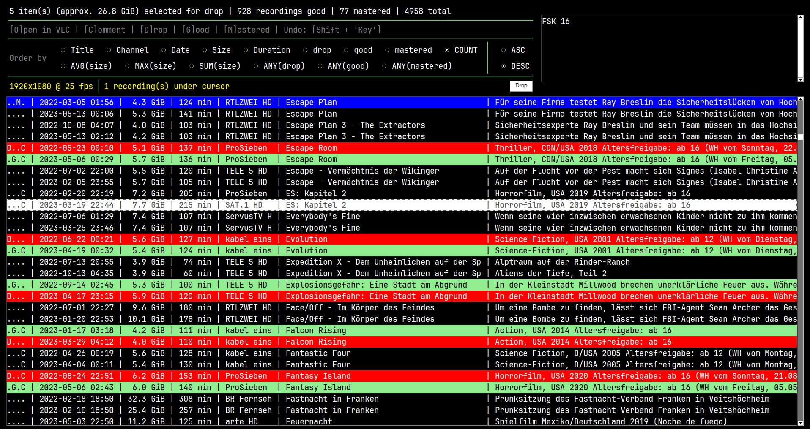

# Enigma2 DVR Manager

The Enigma2 **D**irect **V**ideo **R**ecording Manager is a GUI-based tool for managing, sorting 
and selectively deleting (duplicate) TV recordings made by an Enigma2 Linux-based TV recorder.



## Disclaimer

### This program is still a work in progress!

Features may be deleted or changed in functionality without further notice.  
It may be that the documentation below is not updated in time and therefore
may not document the real behavior of the program.

If so, please let me know or open a Pull Request with a suitable correction.

Any help is appreciated :)

### Use this software at your own risk!

**I am not responsible** if you use this program (wrongly) and/or
destroy important files on your system.

**Always** check the file paths **before** deleting to be sure everything is correct!

## Features

- Somewhat minimalistic GUI
- Easy to use (if you like keyboard shortcuts)
- No overwhelming sub-menus 
- Mark entries as good, selected for deletion or already mastered
- Add comments for additional information about the recording or download
- Only **read-only**: Operations will never change any recording or download. There is no deletion implemented directly,
  so you have full control over your files.

## Dependencies

- JetBrains Mono font (*you can change the global variable `GUI_FONT` at the top of `dvr_manager.py`*)
  or any other (monospace) font

- OpenCV `cv2` (tested: 4.11.0)
- FreeSimpleGUI (tested: 5.1.1)

Use the Package Installer for Python `pip3`:
```shell
pip3 install --user [--break-system-packages] opencv-python freesimplegui
```

## Configuration

Specify the directories to load files from in `config.json` before using the software:

```json
{
	"rec_paths": [
		"/home/user/dvr/2022",
		"/home/user/dvr/2023"
	],

	"dl_paths": [
		"/home/user/downloads/2024",
		"/home/user/downloads/2025"
	]
}
```

Engima2 Recordings typically consist of six (three are not required by
the software and can be mass-deleted beforehand) related files with the
following file name structure:

```
Timestamp       Channel     Recording title

20230219 0230 - TELE 5 HD - Why Don't You Just Die!.eit       (required, more metadata)
20230219 0230 - TELE 5 HD - Why Don't You Just Die!.ts        (required, the main video file)
20230219 0230 - TELE 5 HD - Why Don't You Just Die!.ts.ap     (optional)
20230219 0230 - TELE 5 HD - Why Don't You Just Die!.ts.cuts   (optional)
20230219 0230 - TELE 5 HD - Why Don't You Just Die!.ts.meta   (required, most of the metadata)
20230219 0230 - TELE 5 HD - Why Don't You Just Die!.ts.sc     (optional)
```

Downloads are structured differently in
a [Jellyfin](https://github.com/jellyfin/jellyfin)-compatible format:

```
Download title   Year   TMDB-ID          Source (Version)

Dampfnudelblues (2013) [tmdbid=209232] - Mediathek.mp4

Don Camillo und Peppone (1952) [tmdbid=11972] - Mediathek (Original).mp4
Don Camillo und Peppone (1952) [tmdbid=11972] - Mediathek (Remastered).mp4
```

As for now, there is no option to handle different file name structures.
Feel free to adapt the source code to your own needs, if necessary.

## Usage

Simply launch the program in your shell (see [example](#Example) below).
There is currently no option to add or manage loaded directories via the GUI.

```shell
./dvr_manager.py
```

| Keyboard Shortcut | Explanation |
| :---------------: | :---------: |
| F         | Find entries based on their title |
| I         | Show a dialog box containing extended information from the EIT (Event Information Table) |
| O         | Open the first selected entry in VLC |
| C         | Add or change the comment of one selected recording |
| Shift + C | Add or change the comment of the first recording and **overwrite the comments of all recordings under the cursor** with this one |
| D         | Select all recordings under the cursor for drop / Apply the D attribute to the selected recordings |
| Shift + D | Remove the D attribute from the selected recordings |
| G         | Mark recording as good / Apply the G attribute to the selected recordings |
| Shift + G | Remove the G attribute from the selected recordings |
| M         | Mark recording as mastered / Apply the M attribute to the selected recordings |
| Shift + M | Remove the M attribute from the selected recordings |

**If a recording is marked as mastered, it cannot be dropped and vice versa.**

If you press the `Drop` button, the file paths of all files belonging
to all recordings marked with the D attribute are written into the file
`dropped` in the directory of this program.

You can review the files again and then delete them manually or using:
```shell
xargs -d '\n' -n 1 rm -vf < dropped
```

**[Deletion is permanent](#disclaimer)! So be careful what you delete!**

If you restart the software without deleting/moving your dropped recordings,
they will reappear in the recording list, but **without any previously set attributes**
or comments, as any metadata will be purged from the local database when pressing `Drop`.

If you are not yet confident about deletion,
you can move the files to another directory to circumvent this behavior:
```shell
mkdir -p DROPPED_RECORDINGS && xargs -d '\n' -n 1 mv -vt DROPPED_RECORDINGS < dropped
```

## Example

```shell
$ ./dvr_manager.py
Scanning directories... (This may take a while)
Successfully scanned 7 directories.
Processing recordings... (This may take a while)
Recordings successfully processed: 6994 recording files (6990 in cache, 4 new) and 86 deleted after mastering
Scanning directories... (This may take a while)
Successfully scanned 1 directories.
Processing downloads... (This may take a while)
Downloads successfully processed: 46 download files (46 in cache, 0 new)
7126 total entries
```
